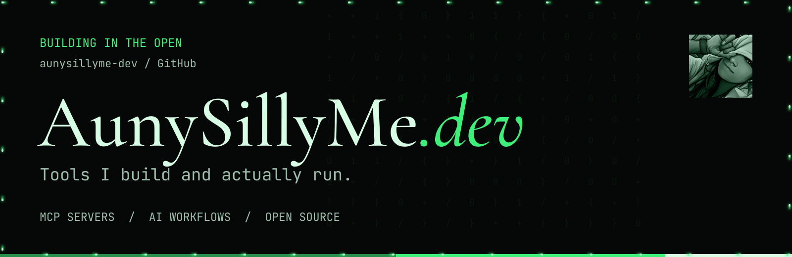
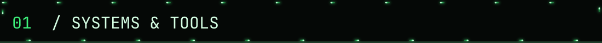
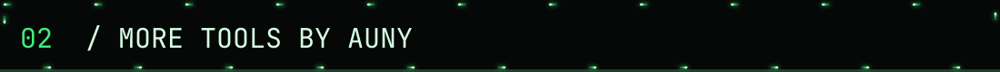
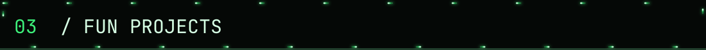
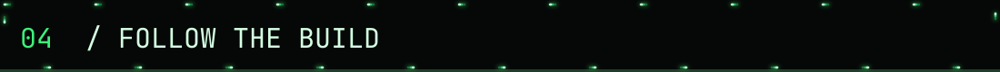

  

  
  
  

I'm [Auny](https://github.com/aunysillyme). This is where I share the MCP servers, workflows, and systems behind my AI setup. I build them for my own work, then open-source what other people can use.

## 

### [grok-mcp-server](https://github.com/aunysillyme-dev/grok-mcp-server)

Bring Grok's X search, web search, chat, vision, and media tools into your MCP client. Deploy your own copy to Cloudflare with your own xAI API key.

[Source & setup](https://github.com/aunysillyme-dev/grok-mcp-server#readme)

### [ai-creator-os](https://github.com/aunysillyme-dev/ai-creator-os)

An Obsidian, Claude, and MCP setup for creative work. Templates and documented workflows for content, music releases, and day-to-day operations.

[Explore the workflows](https://github.com/aunysillyme-dev/ai-creator-os#readme)

### [claude-os](https://github.com/aunysillyme-dev/claude-os)

Session protocols, vault architecture, and tool routing for a coordinated AI setup. Includes a CLAUDE.md template and a starter vault.

[Explore the framework](https://github.com/aunysillyme-dev/claude-os#readme)

## 

My npm tools live on my personal account, [@aunysillyme](https://github.com/aunysillyme).

- **[model-orchestrator](https://github.com/aunysillyme/model-orchestrator):** route work across your AI coding tools.
- **[agent-personalizer](https://github.com/aunysillyme/agent-personalizer):** one profile and instructions for every AI you use.
- **[website-build-skill](https://github.com/aunysillyme/website-build-skill):** teach your AI to research, design, build, and review websites.

[Browse my npm packages](https://www.npmjs.com/~aunysillyme)

## 

Small things I build to see what happens.

- **[hearsay](https://github.com/aunysillyme-dev/hearsay):** pass a message down the line, then see who changed it.
- **[seconded](https://github.com/aunysillyme-dev/seconded):** a concern is heard when a second person has it too.
- **[wat-we-building](https://github.com/aunysillyme-dev/wat-we-building):** five questions before the AI builds.

## 

Demos and project guides on [aunysillyme.dev](https://aunysillyme.dev). What I'm building and learning on [X](https://x.com/AunySillyMe) and [my blog](https://aunysillyme.com/blog).

Questions about a tool? Open an issue in its repository so the context stays with the project.

Branding and marketing consulting: [aunysillyme.com](https://aunysillyme.com).
